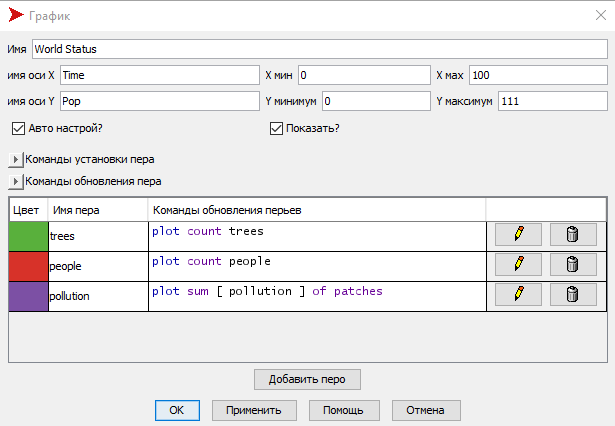
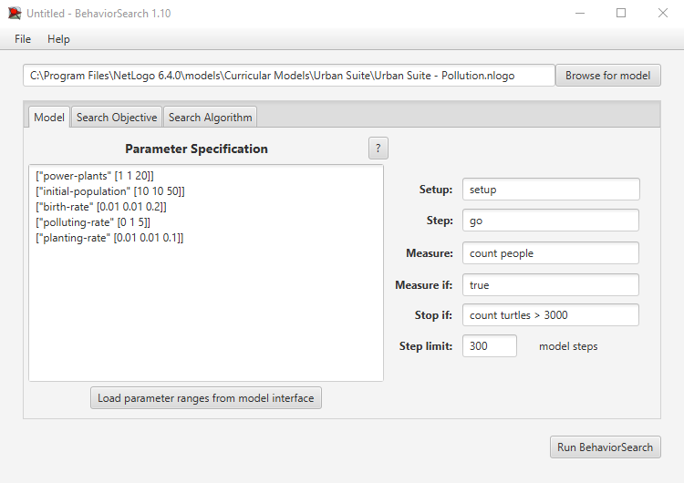
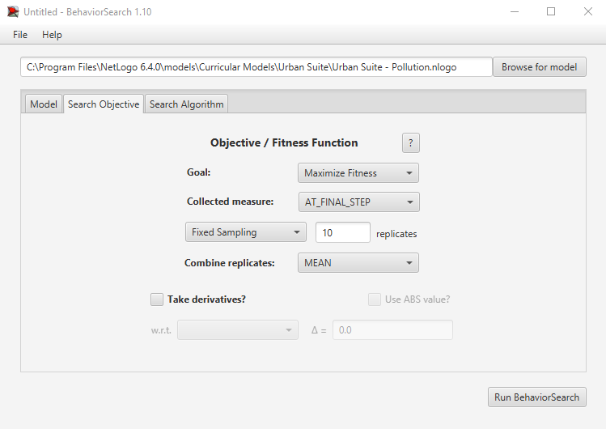
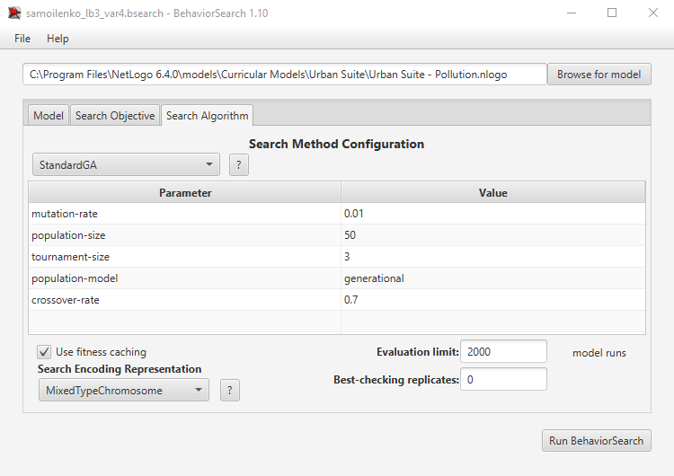
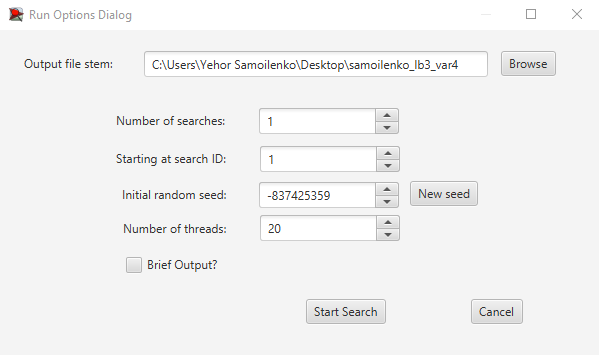
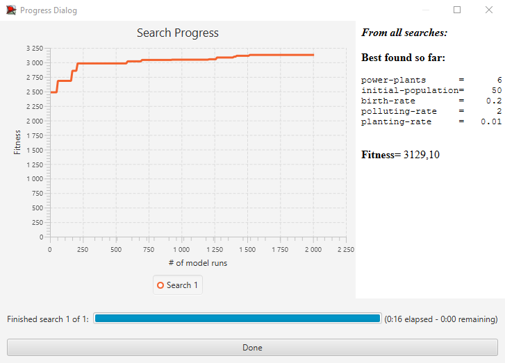
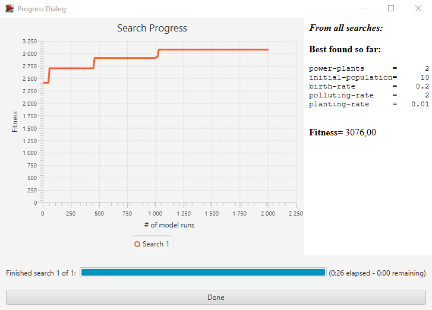

## Комп'ютерні системи імітаційного моделювання
## СПм-22-4, **Самойленко Єгор Олексійович**
### Лабораторна робота №**3**. Використання засобів обчислювального інтелекту для оптимізації імітаційних моделей

 

### Варіант 4, модель у середовищі NetLogo:
[Urban Suite - Pollution. Забруднення повітря та боротьба з ним.](https://www.netlogoweb.org/launch#http://www.netlogoweb.org/assets/modelslib/Curricular%20Models/Urban%20Suite/Urban%20Suite%20-%20Pollution.nlogo)

 

### Вербальний опис моделі:
Модель "Urban Suite - Pollution" досліджує динаміку вразливої рівноваги екосистеми хижак-жертва, де взаємодіють популяції людей, елементи ландшафту та рої забруднюючих агентів.

Модель використовує принцип негативного зворотного зв'язку: елементи забруднення (хижаки) стримують розмноження жителів (жертв), тоді як жителі сприяють зменшенню забруднення. Електростанції викидають забруднення, яке впливає на здоров'я людей, але вони можуть вживати заходів для зменшення цього впливу, наприклад, саджати дерева. Здоров'я людей природно погіршується з часом, але вони можуть розмножуватися, забезпечуючи стійкість їхньої популяції.

Завдяки цій моделі можна вивчити, як змінюється кількість популяцій протягом часу, спостерігаючи за регулярними чи нерегулярними циклами їхнього розмноження.

### Керуючі параметри:
- **initial-population**: цей параметр визначає початкову кількість людей в моделі. Значення встановлює стартову популяцію, від якої відбувається розмноження;
- **birth-rate**: параметр, що контролює швидкість розмноження людей в екосистемі. Визначає ймовірність того, що кожна особа буде мати нащадків протягом певного періоду;
- **planting-rate**: визначає ймовірність того, що людина буде садити дерево щорічно (швидкість висадження дерев);
- **power-plants**: встановлює початкову кількість електростанцій у моделі. Ці електростанції генерують забруднення, яке впливає на здоров'я популяції людей;
- **polluting-rate**: визначає рівень забруднення, що викидається кожною електростанцією щороку. Цей параметр впливає на загальний рівень забруднення в екосистемі та визначає його вплив на здоров'я людей.

### Внутрішні параметри:
- **trees**: цей параметр представляє кількість дерев в екосистемі моделі. Дерева виконують функцію очищення середовища від забруднення, впливаючи на загальний рівень забруднення в околиці, а також впливають на здоров'я популяції людей;
- **people**: параметр визначає кількість людей в екосистемі моделі. Люди розмножуються, саджають дерева та взаємодіють один з одним та з іншими елементами системи;
- **pollution**: параметр, що відображає рівень забруднення в екосистемі. Виникає внаслідок викидів електростанцій та впливає на здоров'я популяції людей. Забруднення розповсюджується в середовищі та зменшується завдяки дії дерев.

### Показники роботи системи:
- показники висадження (кількості) дерев;
- показники чисельності населення;
- показники рівня забруднення навколишнього середовища.

 

### Налаштування середовища BehaviorSearch:

**Обрана модель**:
<pre>
C:\Program Files\NetLogo 6.4.0\models\Curricular Models\Urban Suite\Urban Suite - Pollution.nlogo
</pre>

**Параметри моделі** (вкладка Model):  
*Параметри та їх можливі діапазони були автоматично вилучені середовищем BehaviorSearch із вибраної імітаційної моделі, та виправлені для більшої реалістичності.*

Початкові параметри:
<pre>
["power-plants" [0 1 20]]
["initial-population" [0 10 100]]
["birth-rate" [0 0.01 0.2]]
["polluting-rate" [0 1 5]]
["planting-rate" [0 0.01 0.1]]
</pre>

Змінені параметри:
<pre>
["power-plants" [1 1 20]]
["initial-population" [10 10 50]]
["birth-rate" [0.01 0.01 0.2]]
["polluting-rate" [0 1 5]]
["planting-rate" [0.01 0.01 0.1]]
</pre>

Зміна параметрів призведе до скорочення часу симуляції, а також до уникнення сценаріїв з відсутністю електростанцій (power-plants), народжуваності (birth-rate) та відсутності посадки дерев (planting-rate).

**Використовувана міра**:  
Для фітнес-функції було обрано **кількість людей (count people)**, вираз для розрахунку взято з налаштувань графіка аналізованої імітаційної моделі в середовищі NetLogo:  
  
та вказано у параметрі "**Measure**":
<pre>
count people
</pre>

У ході симуляції моделі значення кількості людей (count people) буде змінюватися у кожен такт часу в залежності від факторів: народжуваності (birth-rate), посадки дерев (planting-rate), кількості електростанцій (power-plants). Симуляція буде проводитися протягом 300 тактів, починаючи з нульового такту.

*Параметр "**Measure if**" зі значенням true, по суті, і означає, що враховуватимуться всі такти симуляції, а чи не частина їх.*

*Параметри "**Setup**" та "**Go**" вказують відповідні процедури ініціалізації та запуску в логіці моделі. BehaviorSearch в процесі роботи, по суті, замість користувача запускає ці процедури.*

*Параметр зупинки за умовою ("**Stop if**") налаштовуємо таким чином, щоб пошук завершувався при досягненні популяції людей у розмірі 3000 осіб.*

Загальний вигляд вкладки налаштувань параметрів моделі:  

**Налаштування цільової функції** (вкладка Search Objective):  
Метою налаштування параметрів імітаційної моделі, яка відтворює динаміку виживання людської популяції з урахуванням різних факторів реального світу, є максимізація кількості осіб. Це визначено через параметр "**Goal**" зі значенням **Maximize Fitness**. Іншими словами, мета полягає в тому, щоб визначити такі параметри моделі, при яких на кінець симуляції (тривалість якої вказана як **300 років**) популяція людей досягне максимально можливого рівня. Для досягнення цієї мети у параметрі "**Collected measure**", який визначає спосіб обчислення обраного показника, вказано **AT_FINAL_STEP**.

Для того щоб уникнути впливу випадкових значень на об'єктивність результатів через внутрішню логіку імітаційної моделі, **кожен етап симуляції повторюється 10 разів**. Результуюче значення обчислюється як **середнє арифметичне з отриманих результатів**.

Загальний вигляд вкладки налаштувань цільової функції:  

**Налаштування алгоритму пошуку** (вкладка Search Algorithm):  
*На цьому етапі було визначено модель, налаштовано її параметри (тобто вказано, які в процесі пошуку можуть змінюватися і в яких діапазонах), і обрано міру, що лежить в основі функції пристосованості, що дозволяє оцінити якість кожного перевіряємого BehaviorSearch варіантів рішення.*

*У ході дослідження на лабораторній роботі використовуються два алгоритми: Випадковий пошук (**RandomSearch**) і Простий генетичний алгоритм (**StandardGA**).*

*Для цих алгоритмів, що вирішують завдання пошуку такого набору параметрів імітаційної моделі, щоб задовольнити вимоги користувача (у нашому випадку – максимізувати значення кількості людей - агентів у заданій імітаційній моделі), вказуємо що "**Evaluation limit**" = 2000 (число ітерацій пошуку, у разі ГА – це буде кількість поколінь), та "**Search Space Encoding Representation**" = MixedTypeChromosome (спосіб кодування варіанта вирішення). Параметр "**Use fitness caching**" впливає лише на продуктивність.*

*Параметри, специфічні для генетичного алгоритму, використовуємо за замовчанням.*

Загальний вид вкладки налаштувань алгоритму пошуку:

 

### Результати використання BehaviorSearch:
Діалогове вікно запуску пошуку:  

Результат пошуку параметрів імітаційної моделі, використовуючи **генетичний алгоритм**:  

Результат пошуку параметрів імітаційної моделі, використовуючи **випадковий пошук**:  

**Висновок**:
Випадковий пошук продемонстрував більшу ефективність у знаходженні оптимальних параметрів при вищому значенні ефективності.