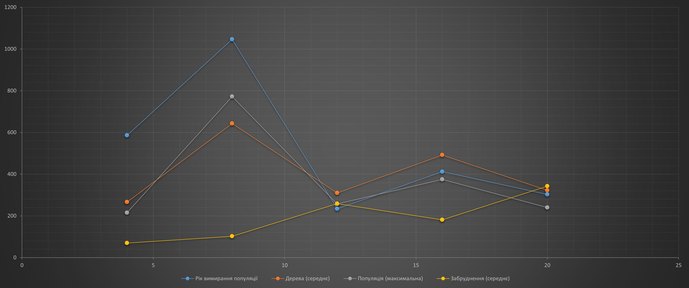
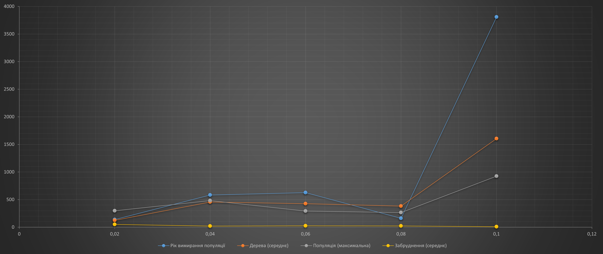

## Комп'ютерні системи імітаційного моделювання
## СПм-22-4, **Самойленко Єгор Олексійович**
### Лабораторна робота №**1**. Опис імітаційних моделей та проведення обчислювальних експериментів

 

### Варіант 4, модель у середовищі NetLogo:
[Urban Suite - Pollution. Забруднення повітря та боротьба з ним.](https://www.netlogoweb.org/launch#http://www.netlogoweb.org/assets/modelslib/Curricular%20Models/Urban%20Suite/Urban%20Suite%20-%20Pollution.nlogo)

 

### Вербальний опис моделі:
Модель "Urban Suite - Pollution" досліджує динаміку вразливої рівноваги екосистеми хижак-жертва, де взаємодіють популяції людей, елементи ландшафту та рої забруднюючих агентів.

Модель використовує принцип негативного зворотного зв'язку: елементи забруднення (хижаки) стримують розмноження жителів (жертв), тоді як жителі сприяють зменшенню забруднення. Електростанції викидають забруднення, яке впливає на здоров'я людей, але вони можуть вживати заходів для зменшення цього впливу, наприклад, саджати дерева. Здоров'я людей природно погіршується з часом, але вони можуть розмножуватися, забезпечуючи стійкість їхньої популяції.

Завдяки цій моделі можна вивчити, як змінюється кількість популяцій протягом часу, спостерігаючи за регулярними чи нерегулярними циклами їхнього розмноження.

### Керуючі параметри:
- **initial-population**: цей параметр визначає початкову кількість людей в моделі. Значення встановлює стартову популяцію, від якої відбувається розмноження;
- **birth-rate**: параметр, що контролює швидкість розмноження людей в екосистемі. Визначає ймовірність того, що кожна особа буде мати нащадків протягом певного періоду;
- **planting-rate**: визначає ймовірність того, що людина буде садити дерево щорічно (швидкість висадження дерев);
- **power-plants**: встановлює початкову кількість електростанцій у моделі. Ці електростанції генерують забруднення, яке впливає на здоров'я популяції людей;
- **polluting-rate**: визначає рівень забруднення, що викидається кожною електростанцією щороку. Цей параметр впливає на загальний рівень забруднення в екосистемі та визначає його вплив на здоров'я людей.

### Внутрішні параметри:
- **trees**: цей параметр представляє кількість дерев в екосистемі моделі. Дерева виконують функцію очищення середовища від забруднення, впливаючи на загальний рівень забруднення в околиці, а також впливають на здоров'я популяції людей;
- **people**: параметр визначає кількість людей в екосистемі моделі. Люди розмножуються, саджають дерева та взаємодіють один з одним та з іншими елементами системи;
- **pollution**: параметр, що відображає рівень забруднення в екосистемі. Виникає внаслідок викидів електростанцій та впливає на здоров'я популяції людей. Забруднення розповсюджується в середовищі та зменшується завдяки дії дерев.

### Показники роботи системи:
- показники висадження (кількості) дерев;
- показники чисельності населення;
- показники рівня забруднення навколишнього середовища;

### Недоліки моделі:
- адаптація: модель може не враховувати можливості адаптації популяцій до змін у середовищі. В реальному світі люди можуть розвивати механізми адаптації, щоб виживати в змінюючихся умовах;
- географічне розположення: модель може не враховувати географічні особливості, які можуть впливати на поширення забруднення та інші аспекти екосистеми.

### Примітки:
Зі звичайними налаштуваннями популяції в кінці кінців вимирають, але тривалість їхнього існування значно варіює.

 

## Обчислювальні експерименти

### 1. Вплив швидкості розмноження на виживання популяції людей
Досліджується залежність виживання популяції людей протягом певної кількості років (до смерті популяції) від швидкості розмноження, зазначеного на початку симуляції.
Експерименти проводяться при 0,02-0,12 швидкості розмноження, з кроком 0,02, усього 6 симуляцій.  
Інші керуючі параметри мають значення за замовчуванням:
- **initial-population**: 30;
- **planting-rate**: 0,05;
- **power-plants**: 2;
- **polluting-rate**: 3.

<table>
<thead>
<tr><th>Швидкість розмноження</th><th>Рік вимирання популяції</th><th>Дерева (середнє)</th><th>Популяція (максимальна)</th><th>Забруднення (середнє)</th></tr>
</thead>
<tbody>
<tr><td>0,02</td><td>58</td><td>47,83</td><td>33</td><td>65,67</td></tr>
<tr><td>0,04</td><td>91</td><td>67,72</td><td>57</td><td>92,21</td></tr>
<tr><td>0,06</td><td>76</td><td>104,59</td><td>81</td><td>56,01</td></tr>
<tr><td>0,08</td><td>114</td><td>109,46</td><td>100</td><td>42,58</td></tr>
<tr><td>0,1</td><td>6188</td><td>5846,60</td><td>5200</td><td>3,51</td></tr>
<tr><td>0,12</td><td>∞</td><td>∞</td><td>∞</td><td>∞</td></tr>
</tbody>
</table>

Графік ілюструє експоненційне зростання людської популяції, враховуючи той факт, що інтенсивне розмноження призводить до чисельних змін: збільшення кількості людей, насадження більше дерев та зменшення рівня забруднення. Ці процеси взаємодіють, що призводить до тривалішого та здоровішого життя популяції людей.

 

### 2. Залежність виживання популяції від кількість електростанцій
Досліджується залежність виживання популяції людей протягом певної кількості років (до смерті популяції) від кількості електростанцій, зазначених на початку симуляції.
Експерименти проводяться при 4-20 кількості електростанцій, з кроком 4, усього 5 симуляцій.  
Інші керуючі параметри мають значення за замовчуванням:
- **initial-population**: 30;
- **birth-rate**: 0,1;
- **planting-rate**: 0,05;
- **polluting-rate**: 3.

<table>
<thead>
<tr><th>Кількість електростанцій</th><th>Рік вимирання популяції</th><th>Дерева (середнє)</th><th>Популяція (максимальна)</th><th>Забруднення (середнє)</th></tr>
</thead>
<tbody>
<tr><td>4</td><td>586</td><td>266,64</td><td>215</td><td>69,98</td></tr>
<tr><td>8</td><td>1046</td><td>642,97</td><td>772</td><td>102</td></tr>
<tr><td>12</td><td>234</td><td>309,95</td><td>257</td><td>258,43</td></tr>
<tr><td>16</td><td>412</td><td>492,22</td><td>375</td><td>181,41</td></tr>
<tr><td>20</td><td>303</td><td>322,26</td><td>240</td><td>342,66</td></tr>
</tbody>
</table>

Графік чітко демонструє взаємозв'язок: із зростанням кількості електростанцій спостерігається збільшення рівня забруднення, що в свою чергу призводить до зменшення посадки дерев та зменшення чисельності людської популяції.

 

### 3. Вплив швидкості висадження дерев на виживання популяції людей
Досліджується залежність виживання популяції людей протягом певної кількості років (до смерті популяції) від швидкості висадження дерев, зазначених на початку симуляції.
Експерименти проводяться при 0,02-0,1 швидкості висадження дерев, з кроком 0,02, усього 5 симуляцій.  
Інші керуючі параметри мають значення за замовчуванням:
- **initial-population**: 30;
- **birth-rate**: 0,1;
- **power-plants**: 2;
- **polluting-rate**: 3.

<table>
<thead>
<tr><th>Швидкість висадження дерев</th><th>Рік вимирання популяції</th><th>Дерева (середнє)</th><th>Популяція (максимальна)</th><th>Забруднення (середнє)</th></tr>
</thead>
<tbody>
<tr><td>0,02</td><td>139</td><td>124,91</td><td>297</td><td>50,70</td></tr>
<tr><td>0,04</td><td>584</td><td>456,22</td><td>482</td><td>19,78</td></tr>
<tr><td>0,06</td><td>628</td><td>425,28</td><td>292</td><td>24,90</td></tr>
<tr><td>0,08</td><td>160</td><td>381,54</td><td>264</td><td>22,28</td></tr>
<tr><td>0,1</td><td>3809</td><td>1605,50</td><td>925</td><td>7,75</td></tr>
</tbody>
</table>

Графік демонструє, що зі зростанням темпів висадження дерев спостерігається збільшення середньої кількості дерев. Крім того, варто відзначити, що зростання популяції пов'язане із зменшенням середнього рівня забруднення середовища, що свідчить про позитивний вплив активного висадження дерев.