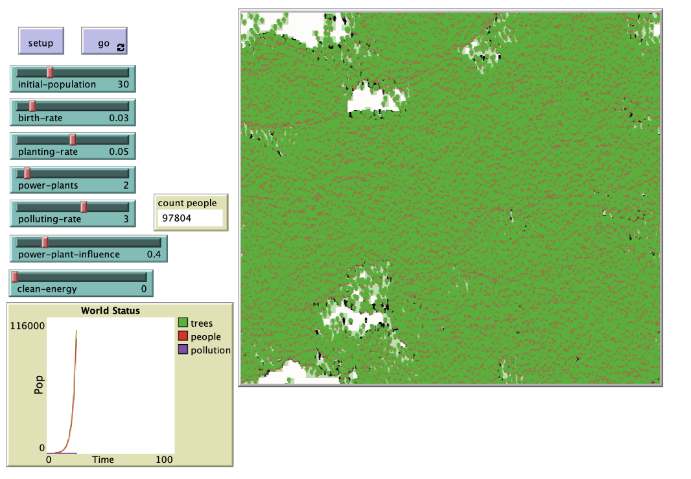

## Комп'ютерні системи імітаційного моделювання
## СПм-22-4, **Самойленко Єгор Олексійович**
### Лабораторна робота №**2**. Редагування імітаційних моделей у середовищі NetLogo

 

### Варіант 4, модель у середовищі NetLogo:
[Urban Suite - Pollution. Забруднення повітря та боротьба з ним.](https://www.netlogoweb.org/launch#http://www.netlogoweb.org/assets/modelslib/Curricular%20Models/Urban%20Suite/Urban%20Suite%20-%20Pollution.nlogo)

 

### Внесені зміни у вихідну логіку моделі, за варіантом:

Було реалізовано позитивний ефект, пов'язаний з присутністю електростанцій, на ймовірність виникнення нових осіб. Була введена нова змінна "**power-plant-influence**" (вплив електростанцій) у характеристиках клітин, що сприяє збільшенню ймовірності народження нових індивідів:

<pre>
patches-own [
  power-plant-influence
]
</pre>

Міняємо ймовірність появи дерев у клітинах, розташованих неподалік від електростанцій:

<pre>
to maybe-plant  ;; person procedure
  if random-float 1 < planting-rate + power-plant-influence [
    hatch-trees 1 [
      set health 5
      set color green
    ]
  ]
end
</pre>

Впроваджуємо позитивний ефект виникнення нових осіб за умови наявності електростанцій:

<pre>
to reproduce  ;; person procedure
  if health > 4 and random-float 1 < birth-rate + power-plant-influence [
    hatch-people 1 [
      set health 5
    ]
  ]
end
</pre>

Додано метод "**update-clean-energy-effect**", для кожної клітини (patch) з чистою енергією більше 0, вона запитує всі сусідні клітини і збільшує їхню швидкість народження (birth-rate) на кількість чистої енергії, помножену на 0.001. Метод призначений для розповсюдження позитивного впливу чистої енергії на оточуючі клітини, збільшуючи їхню вірогідність народження нових осіб.

<pre>
to update-clean-energy-effect
  ask patches with [clean-energy > 0] [
    ask neighbors [
      set birth-rate birth-rate + (clean-energy * 0.001)
    ]
  ]
end
</pre>

### Внесені зміни у вихідну логіку моделі, на власний розсуд:
Розглянемо вплив вітру на росповсюдження зараження. Додано новий атрибут wind-speed, wind-direction.

<pre>
patches-own [
  wind-speed
  wind-direction
]
</pre>

Додано новий метод для симуляції вітру:
<pre>
to move  ;; wind-path procedure
  rt random-float 30 - random-float 30
  fd wind-speed
  if pcolor = red [ set color blue - 2 ]
end
</pre>

Зменшимо еффект зараження зі збільшенням щвидкості вітру:
<pre>

to pollute  ;; patch procedure
  if is-power-plant? [
    set pcolor red
    set pollution polluting-rate
  ]
  
 if pollution > 0 [
    set pollution pollution - (pollution * wind-speed / 100)
  ]

  set pcolor scale-color red (pollution - .1) 5 0
end
</pre>

### Вплив швидкості вітру на забрудненність середовища
Досліджується залежність забрудненості від посадки дерев.
Експерименти проводяться при 0-10 коеф. посадки, з кроком 5, усього 5 симуляцій.  
Інші керуючі параметри мають значення за замовчуванням:
- **initial-population**: 30
- **birth-rate**: 0.1
- **power-plants**: 2
- **polluting-rate**: 3
- **planting-rate**: 0.05

<table>
<thead>
<tr><th>Швидкість вітру</th><th>Дерева max</th><th>Населення max</th><th>Забруднення max</th></tr>
</thead>
<tbody>
<tr><td>0</td><td>84</td><td>37</td><td>129</td></tr>
<tr><td>2</td><td>86</td><td>34</td><td>102</td></tr>
<tr><td>4</td><td>89</td><td>36</td><td>86</td></tr>
<tr><td>6</td><td>83</td><td>35</td><td>71</td></tr>
<tr><td>8</td><td>67</td><td>36</td><td>52</td></tr>
<tr><td>10</td><td>59</td><td>37</td><td>41</td></tr>
</tbody>
</table>

З висновку експерименту видно, що при збільшенні вітру забруднення зменшується.